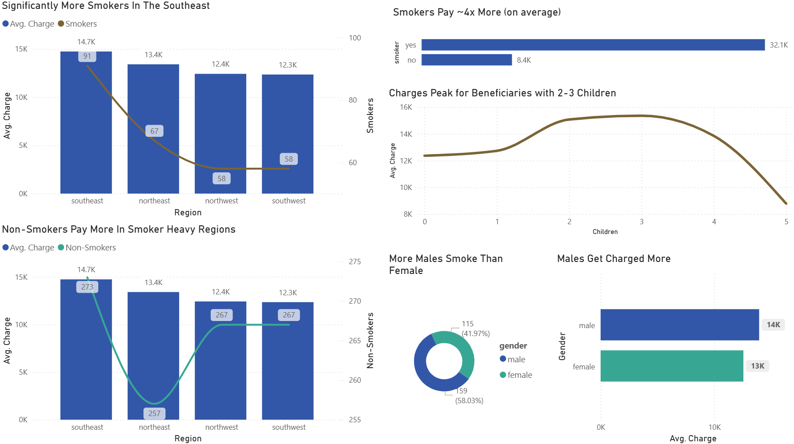

# Medical Insurance Costs; A Case Study

**Andrew Castro**

---

### Introduction

The Medical Insurance Cost data was downloaded from a publicly sourced dataset on Kaggle. I first imported it into Microsoft Excel to analyze the Column Dictionary available, which notably contained the following columns: age, gender, bmi, children, smoker, region, and charges.

**Hypothesis 1:** Average insurance charges differ between female(s) and male(s). 
**Hypothesis 2:** Male(s) have higher average rates of smoking than female(s).

---

### EDA & Methodology

More than just gender to insurance charge correlation, there are also exploratory data analytics which can be done in association to my hypotheses. In particular, how the relationship between gender percentages varies between specific regions within the United States, or how the quantitative amount of children and smoke rates, may play a role in these dynamics.

The dataset was first loaded into Microsoft Excel, and then a pandas DataFrame for cleaning and initial analysis. Key data preparation steps included:

* Python Pandas was used to demonstrate proficiency with coded data manipulation and the potential for automated frequency to improve redundant project efficiency.
* **Column Renaming:** One column was renamed to ‘gender’ for clarity and to prevent potential flagging issues with automated systems.
* **Verification:** All other numerical columns, such as charges and bmi, were verified to be in the correct format for statistical measurement.

---

### Results & Dashboard

**Hypothesis 1 *VERIFIED*:** Average insurance charges are higher for male(s) than female(s). 
**Hypothesis 2 *VERIFIED*:** Male(s) do smoke more than female(s).

#### Individuals Who Smoke Pay More

The single most impactful factor on insurance charges was the smoking rate of the region. However, the cost escalation largely scaled with positive smoke rates rather than negative, seemingly outlining a potential regional or economic baseline.

The data shows that, on average, smokers pay approximately four times more for insurance than non-smokers, with an average charge of $32.1K for smokers compared to just $8.4K for non-smokers.

#### Regional Costs Correlate with Smoker Concentration

While smoking is a primary factor, geography also plays a role. The Southeast region exhibits both the highest number of smokers and the highest average insurance charges for smokers and non-smokers alike. This suggests that baseline insurance costs are higher in this region, potentially due to a variety of regional economic or health factors.

#### Gender Differences and Dependent Impact

The initial hypotheses were supported by the data. Males in this dataset are charged more on average ($14.0K vs. $12.6K for females) and also account for a higher percentage of the smoking population (58% of smokers were male). Additionally, the analysis shows that insurance charges tend to peak for beneficiaries with two to three children before decreasing for those with more dependents.

---

### Conclusion

This case study found that smoking status is the most significant predictor of high medical insurance charges, with smokers paying nearly four times more than non-smokers. Gender, region, and number of dependents also influenced costs, though to a lesser degree. Both initial hypotheses were supported: males face higher charges and have higher smoking rates than females. These findings highlight how lifestyle and demographic factors intersect to shape insurance premiums.
